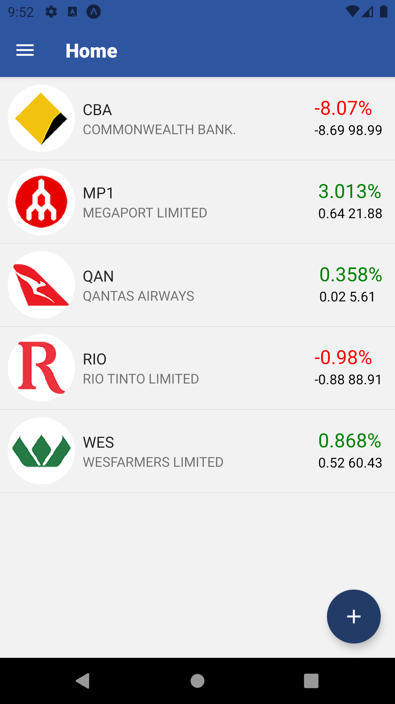
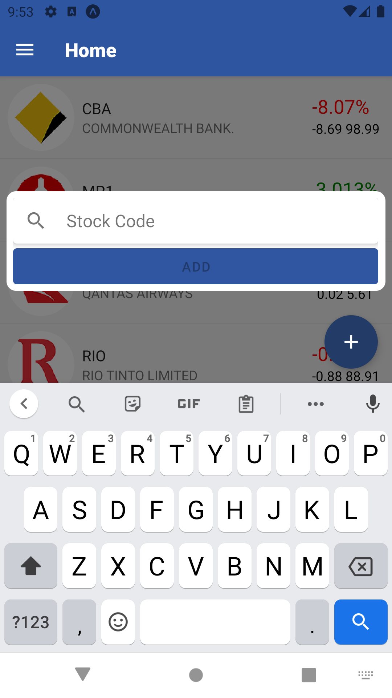
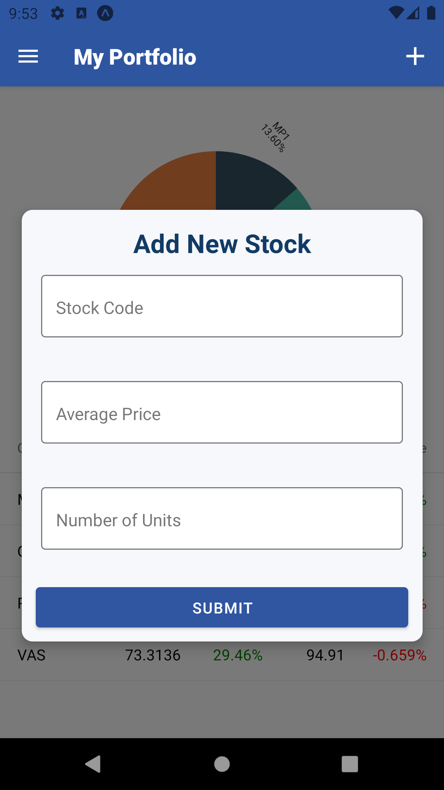

# stockPrice
This is a stock holding tracking mobile application that allows the user to track ASX stocks as well as their stock portfolio with near real-time data

## Getting Started
### Dependencies
* Expo
* MongoDB Atlas
### Installing
* Back-end server: https://github.com/zixic83/stock-price-back-end
* An .env file containing the key named MONGO_URI to access the database is needed

## Functions
- Watchlist
    - Check price movements of the stocks in the watchlist
    - Add stocks to the watchlist
    - Delete stocks from the watchlist
    - Long press company logo to be directed to the corresponding Yahoo Finance page
- Portfolio
    - Add stocks to the stock portfolio
    - Delete stocks from the stock portfolio
    - Update stock holding information (average price/units purchased)
    - Review portfolio performance with illustrative table and pie chart
### Screenshots

## Author
Zixi Chen
https://www.linkedin.com/in/zixi-alice-chen/

## License

This project is licensed under the Apache License 2.0

## Acknowledgments

* [Selfwealth user portal (for design of Portfolio page)](https://www.dadinvestor.com.au/selfwealth-review/)
* [TradingView (Watchlist design)](https://is5-ssl.mzstatic.com/image/thumb/Purple125/v4/9b/7d/94/9b7d9448-d810-81c8-5d35-8948f2cd9525/397ea517-a0be-443b-ad18-91de0cefb57d_3.png/750x750bb.jpeg)
* [Victory](https://github.com/FormidableLabs/victory)
* [React Native Paper](https://github.com/callstack/react-native-paper)

## Disclamer

This application is for training purpose only and should NOT be used to form the basis of any financial/investment decisions. As the data is not real time data (20 minutes delay) so it may be INACCURATE and subject to errors. 

### To-do:
1. search suggestion
1. added stock feedback
1. fix memory leak warning
1. change text input cursor color
 
